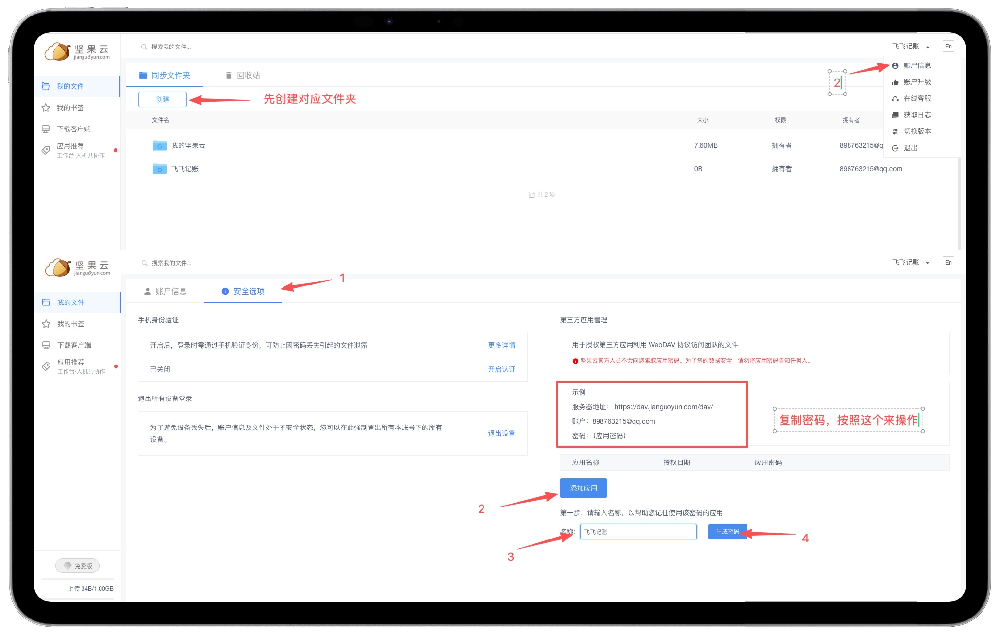
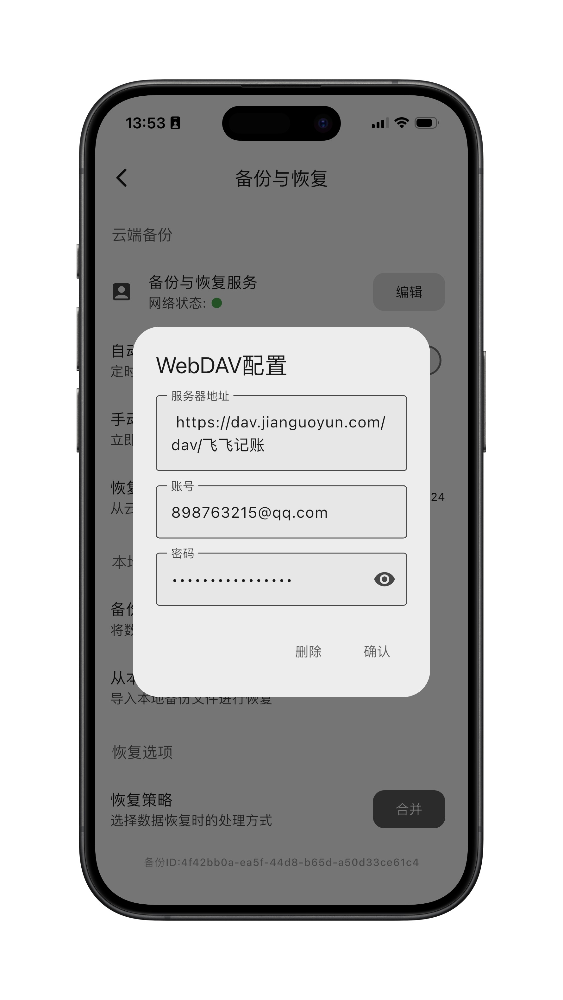

# 使用 WebDAV 备份数据

## 什么是 WebDAV？

WebDAV (Web Distributed Authoring and Versioning) 是一种基于 HTTP 的协议，允许用户像管理本地文件一样管理服务器上的文件。

在飞飞记账中，您可以使用 WebDAV 将数据自动备份到您自己的云存储空间（如坚果云、Nextcloud 等），确保数据安全且不丢失。

## 如何配置 WebDAV 备份

以下是配置 WebDAV 备份的详细步骤：

### 第一步：准备 WebDAV 账号

您需要先拥有一个支持 WebDAV 的网盘账号。我们以**坚果云**为例：

1.  注册并登录坚果云账号。[坚果云官网](https://www.jianguoyun.com)
2.  创建一个新的文件夹
3.  进入账户信息页面。
4.  选择安全选项。
5.  找到“第三方应用管理”，点击“添加应用”。
6.  生成一个该应用专用的密码。

    

> [!TIP]
> **服务器地址**：`https://dav.jianguoyun.com/dav/您的文件夹名称`
> 
> **账号**：您的注册邮箱
> 
> **密码**：刚才生成的应用专用密码（非登录密码）

### 第二步：在 App 中设置

1.  打开飞飞记账 App，点击底部的“我的”。
2.  点击“设置”。
3.  进入“备份与恢复”。
4.  选择“配置远程备份服务”。

    

### 第三步：验证备份

配置完成后，点击验证。
- **绿灯**：表示连接成功。
- **红灯**：表示连接失败，具体原因请参考下方的“常见问题”。

### 自动备份

开启自动备份后，App 每隔 **3天** 启动时会自动进行一次备份。

### 最大备份文件数量

您可以设置保留的最大备份文件数量。
- 当备份文件数量超过您设定的值时，系统会自动删除**最早的**备份文件，以节省空间。

## 常见问题

-   **Q: 连接失败怎么办？**
    -   A: 请检查服务器地址是否正确（注意 `https://` 开头），以及密码是否为应用专用密码。
    -   A: 请确保您的 WebDAV 地址对应的文件夹具有**读写权限**，如果不可读写，也会导致连接失败。
-   **Q: 数据会泄露吗？**
    -   A: 您的数据直接传输到您的私有网盘，App 不会存储您的账号密码或数据，请放心使用。
